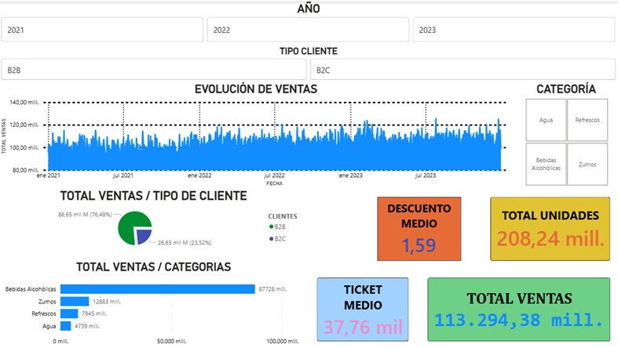
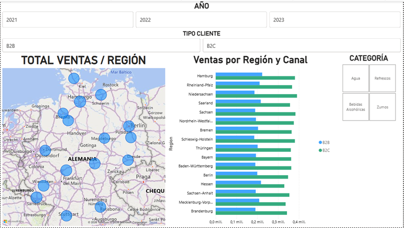
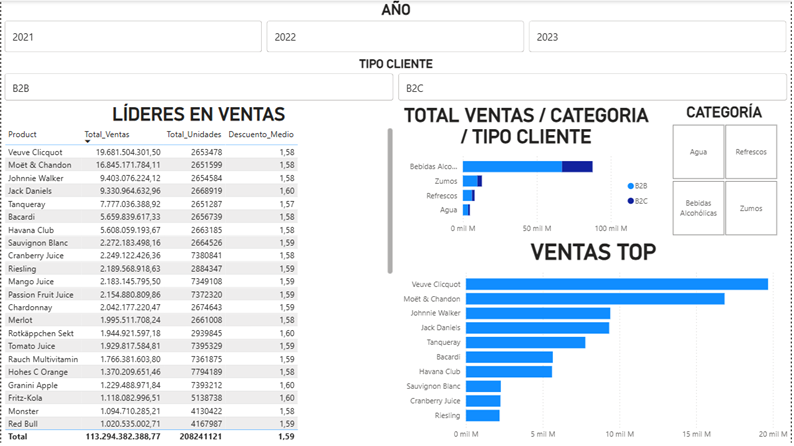

🇬🇧 English version | 🇪🇸 [Versión en español](README_ES.md)

# 🍺 Beverage Sales Dashboard — Power BI

## Overview
Interactive Power BI dashboard analyzing sales performance 
of a beverage distribution company across Germany. 
Built as part of my data analytics portfolio targeting 
Business Intelligence roles in the FMCG sector.

## Objective
To demonstrate end-to-end data analytics skills — from 
data cleaning and transformation to data modeling and 
interactive visualization — using a real-world beverage 
sales dataset.

## Dataset
- **Source:** Kaggle — Beverage Sales Dataset 
  (sebastianwillmann/beverage-sales)
- **License:** MIT
- **Size:** 3,000,000+ rows × 11 columns
- **Period:** January 2021 — December 2023

## Tools & Technologies
- **Power BI Desktop** — dashboard development
- **Power Query (M language)** — data cleaning 
  and transformation
- **DAX** — calculated measures and KPIs
- **Excel** — initial data exploration

## Data Cleaning & Transformation
- Detected and corrected calculation errors in the 
  original Total_Price column
- Created Discount_Rate column (Discount / 100)
- Created Price_After_Discount 
  (Unit_Price × (1 - Discount_Rate))
- Recalculated Total_Price 
  (Price_After_Discount × Quantity)
- Extracted time dimensions: Year, Quarter, 
  Month_Num, Month_Name from Order_Date
- Translated product categories to Spanish
- Built a Calendar table with DAX for time intelligence
- Established relationship: 
  Ventas_Bebidas[Order_Date] → Calendario[Date]

## DAX Measures
- Total_Ventas = SUM(Total_Price)
- Total_Unidades = SUM(Quantity)
- Ticket_Medio = DIVIDE(Total_Ventas, 
  DISTINCTCOUNT(Order_ID))
- Descuento_Medio = AVERAGE(Discount)
- Top10_Ventas = RANKX with TOP 10 filter

## Dashboard Structure
### Page 1 — Executive Summary
- 4 KPI Cards: Total Sales, Total Units, 
  Average Ticket, Average Discount
- Area chart: Sales trend 2021→2023
- Horizontal bar chart: Sales by category
- Pie chart: B2B (76.48%) vs B2C (23.52%)

### Page 2 — Canal & Region
- Bubble map: Total sales by German region
- Stacked bar chart: Sales by region and 
  customer type

### Page 3 — Top Products
- Top 10 products by sales (RANKX DAX measure)
- Stacked bar chart: Sales by category 
  and customer type
- Summary table: Product, Total Sales, 
  Total Units, Average Discount

## Interactive Filters (Slicers)
Synchronized across all 3 pages:
- Year (2021 / 2022 / 2023)
- Customer Type (B2B / B2C)
- Category (Water / Alcoholic Beverages / 
  Soft Drinks / Juices)

## Key Insights
- 📈 Sales grew consistently from 2021 to 2023
- 🍾 Veuve Clicquot leads sales — premium B2B 
  channel dominates
- 🏢 B2B represents 76.48% of total revenue 
  across ALL categories
- 🍺 Alcoholic Beverages account for the largest 
  share of total sales

## Dashboard Preview

## Author
**Daniel Díaz De La Fuente**  
Aspiring Data Analyst | Power BI · SQL · Python · R  
Google Data Analytics Certificate (94.85% avg) · 
Johns Hopkins Business Analytics with Excel  
📍 Seville, Spain  

[LinkedIn](https://www.linkedin.com/in/danieldiazdelafuente/) | [GitHub](https://github.com/DeLabFuente)

> 📥 Dashboard file (.pbix) available on request 
> via LinkedIn